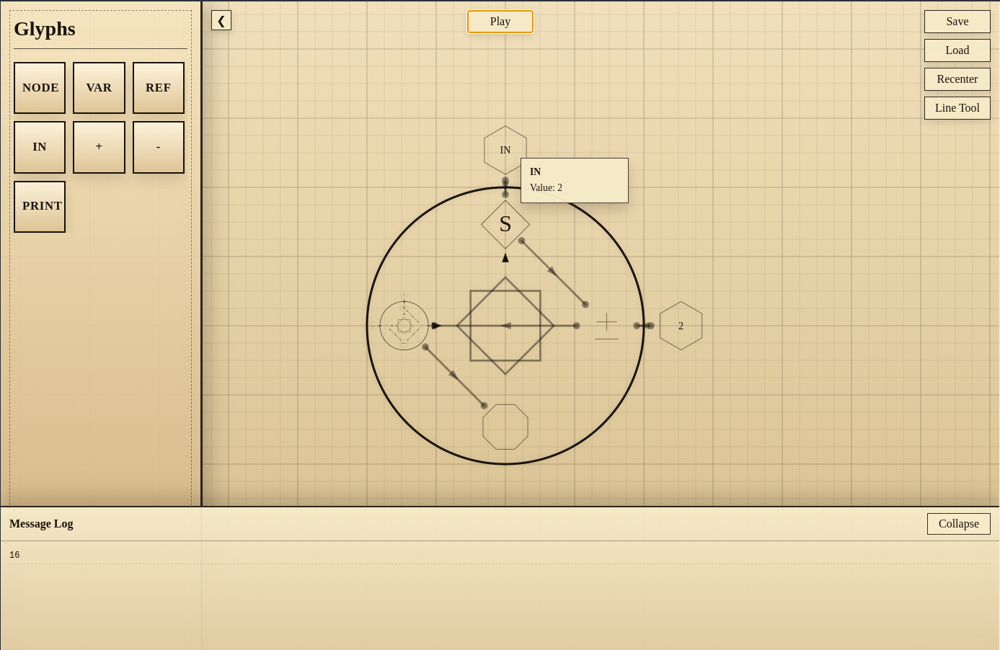
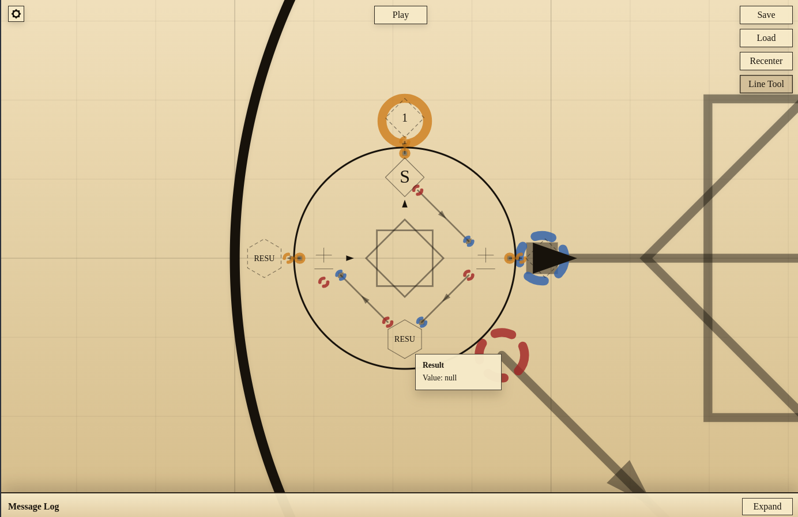

# MagiScript Spell Scripting
---

A visual programming system based around magic circles and layered functions.


Above is a _simple_ script that takes a number (2), adds 2, and doubles it twice. In this case, the result is **16**.


Nodes act as circles-inside-circles, and can be customized just like their parent. They can also contain child Nodes.

Connections between Glyphs can be added and removed with the Line Tool, shown above.

Glyphs can also be moved by dragging them. Dragging them outside of the ring will move them up a layer. Dragging them onto the ring, if they're a type of Value such as a Variable, will add them to the ring so they can be used as a parameter, and dragging them to the core of a Node will delete them.

---

#### Glyphs
- Full reference: [Glyph Guide](./GUIDE.md)

- **Node**
    This is the core of a spell, literally. Nodes act as functions and containers for all Glyphs, including other Nodes.
- **Variable**
    This is a value container. It works just like a variable in any other programming language. You can set and modify it, and use it as a parameter for other glyphs. `var variable = value`
- **Reference**
    This is just a copy of any Variable that exists. Click it to bring up a dropdown to select your Variable, and use it just like the original. `variable = newValue`
- **Input**
    This is another type of value similar to a Reference, but it only exists locally. It holds the value of the Parameters passed to the current Node.
- **Print**
    Prints the passed value to the console.
- **Add**
    Adds two values and returns the result. Default value of 1. You can set the parameter IO to change the increment.
- **Subtract**
    Subtracts two values and returns the result. Default value of 1. You can set the parameter IO to change the decrement.
- **Set Value**
    Sets the rolling program var to the value of the parameter IO.
- **If/Else**
    Can take up to 3 Booleans (drag onto IF glyph and drop). Click label to switch between AND and OR. Outputs to Red output when true and Black output when false.
- **Boolean**
    Simple 0/1 value glyph to act as a switch for some other glyphs. Can have a fixed value, a single condition, or be set.

#### Planned Glyphs
- **Input**
    Pauses execution and create a popup with a text entry.
- **Prompt**
    Pauses execution and create a popup with a yes/no question.
- **PlaySound**
    Plays a sound file.

And more!

The goal is to be able to create CLI/GUI apps and simple games using MagiScript. I'm very optimistic about this project!

There are many bugs, mostly visual, with MagiScript at the moment. These will be fixed as I have time and modivation.
Feel free to create contribute!

---

#### CLI

You can now execute a `.spellcircle` program from the terminal and pass an integer for the entry `IN` variable glyph:

```bash
node cli.js programName.spellcircle <value>
```
or
```bash
npm exec -- magi programName.spellcircle <value>
```

You can also install to your PATH and run globally:

```bash
magi programName.spellcircle <value>
```

Example:

```bash
magi demo/ten-factor.spellcircle 2
```

If `magi` is not available on your PATH yet, run this once from the project root:

```bash
npm link
```

---

**This project is to be consitered Public Domain.**
